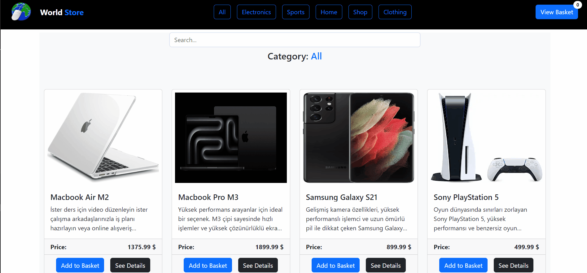

# World Shop

## Project Aim
*This project is a simple shopping website created using HTML, Vanilla JavaScript, SASS, Bootstrap, and Vite. It includes features like DOM manipulation, local storage usage, and data fetching from an API. The website allows users to browse products, add them to the basket, and view the basket contents.*

## Screenshots

[Image Galery Live Page](https://esmaaksoy.github.io/Project-Bootstrap-2/)

## Tech/framework used

<b>Built with</b>  
 
 
 
 
  
  

## How to use?
Browse Products by Category 
Search for Products 
View Product Details 
Add Items to the Basket 
Manage Basket Contents 
View Total Price in the Basket

## API Reference

https://anthonyfs.pythonanywhere.com/api/products/ 

